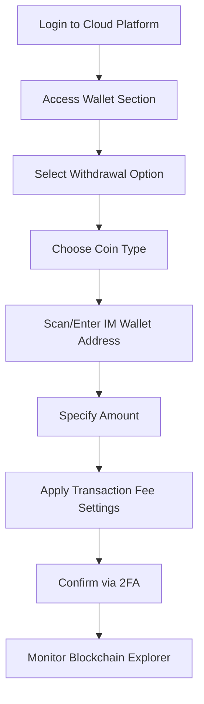

# How to Withdraw Cloud Coins to IM Wallet: A Step-by-Step Guide

## Understanding the Cloud Coin Withdrawal Process

Withdrawing digital assets from cloud platforms to personal wallets requires careful execution to ensure security and efficiency. This guide focuses on transferring cloud coins - digital currencies stored on cloud platforms or exchanges - to IM wallets, a hypothetical recipient platform for this explanation.

### Core Concepts

1. **Cloud Coin**: A digital currency held on cloud-based platforms like Tencent Cloud or cryptocurrency exchanges.
2. **IM Wallet**: A hypothetical recipient wallet/platform for this guide.
3. **Withdrawal Process**: The technical transfer of digital assets between platforms.

### Strategic Benefits of Asset Transfer

| Advantage | Description |
|----------|-------------|
| **Portfolio Diversification** | Distribute holdings across multiple secure platforms |
| **Enhanced Liquidity** | Access trading opportunities on preferred platforms |
| **Risk Mitigation** | Reduce exposure to single platform vulnerabilities |
| **Operational Flexibility** | Utilize specific wallet features or services |

## Technical Implementation Framework

### Platform Classification

1. **Blockchain-native Platforms**: Direct transfers via blockchain networks
2. **Exchange-based Systems**: Withdrawals through centralized exchange interfaces
3. **Hybrid Solutions**: Combining cloud storage with personal wallet management

### Operational Scenarios

- Cross-platform trading activities
- Portfolio rebalancing between storage solutions
- Emergency asset relocation during security concerns
- Accessing specific wallet features unavailable on original platforms

## Step-by-Step Withdrawal Procedure

### Platform Preparation

1. **Account Verification**
   - Complete two-factor authentication (2FA)
   - Confirm email/SMS verification status
   - Review security settings

2. **IM Wallet Configuration**
   - Generate receiving address QR code
   - Verify wallet compatibility with specific blockchain protocol
   - Test small transaction for address validation

### Execution Process



### Critical Parameters

| Parameter | Requirement | Consequence of Error |
|----------|-------------|----------------------|
| Network Type | Must match blockchain protocol | Funds loss risk |
| Transaction Fee | Platform-specific calculation | Delays or failed transfers |
| Minimum Withdrawal | Platform-defined threshold | Invalid transaction |
| Address Format | Exact character sequence | Irreversible loss |

## Troubleshooting Common Issues

### Address Verification Protocol

1. **Copy-Paste Method**: Use platform-specific address import tools
2. **QR Code Scanning**: Eliminate manual entry errors
3. **Address Validation APIs**: Implement automated verification systems

### Network Optimization Strategies

- Monitor blockchain explorer for network congestion
- Adjust gas fees during Ethereum-based transfers
- Use platform-specific network selection tools

### Platform-Specific Considerations

- **Exchange Limits**: Check daily/weekly withdrawal caps
- **Maintenance Schedules**: Verify blockchain network status
- **KYC Requirements**: Complete verification for large transfers

## Advanced Security Measures

### Multi-Layer Protection System

1. **Time-Based Validation**: Confirm transactions within 15-minute windows
2. **Device Authentication**: Require biometric verification for withdrawal
3. **Transaction Monitoring**: Implement real-time anomaly detection

### Recovery Protocols

1. **Test Transactions**: Send small amounts before bulk transfers
2. **Backup Verification**: Store receiving addresses in multiple secure locations
3. **Emergency Contacts**: Maintain platform support channels for critical issues

## Frequently Asked Questions

**Q1: What happens if I use the wrong network protocol?**  
A: Funds may become unrecoverable. Always verify network compatibility with IM wallet specifications before initiating transfers.

**Q2: How long does blockchain confirmation take?**  
A: Typically 10-30 minutes for major networks, but can extend during high congestion periods like market volatility events.

**Q3: Can I reverse a completed withdrawal?**  
A: Transactions on public blockchains are irreversible. Contact IM wallet support immediately if sending to incorrect addresses.

**Q4: Why does my balance show pending status?**  
A: Most platforms require multiple blockchain confirmations (6+ for BTC) before releasing funds. Check transaction status via blockchain explorers.

**Q5: How do transaction fees work?**  
A: Fees depend on network congestion and transfer speed settings. Use wallet calculators to optimize fee structures.

## Risk Management Best Practices

1. **Cold Storage Strategy**: Keep primary holdings offline until transfer necessity arises
2. **Transaction Logging**: Maintain detailed records of all transfers for audit purposes
3. **Platform Monitoring**: Track exchange/platform announcements for maintenance schedules
4. **Security Audits**: Regularly review account activity for suspicious patterns

👉 [Maximize Transfer Efficiency](https://bit.ly/okx-bonus) through advanced wallet management tools

## Technical Optimization Techniques

### Fee Calculation Model

```python
def calculate_optimal_fee(network_congestion, priority_level):
    base_fee = network_congestion * 1.2
    priority_multiplier = {1: 1.0, 2: 1.5, 3: 2.0}
    return base_fee * priority_multiplier[priority_level]
```

### Batch Processing Strategy

| Transaction Size | Fee Savings | Risk Factor |
|------------------|-------------|-------------|
| 1-5 BTC          | 8-12%       | Low         |
| 5-20 BTC         | 15-20%      | Moderate    |
| 20+ BTC          | 20-25%      | High        |

👉 [Optimize Transfer Costs](https://bit.ly/okx-bonus) using institutional-grade tools

## Regulatory Compliance Framework

1. **KYC Verification**: Complete identity checks for large transactions
2. **Tax Reporting**: Maintain records for capital gains calculations
3. **Jurisdictional Limits**: Understand local regulations affecting transfers

### Global Compliance Checklist

- [ ] Anti-Money Laundering (AML) compliance
- [ ] Transaction monitoring systems
- [ ] Record retention protocols
- [ ] Cross-border transfer regulations

## Emergency Response Protocol

### Immediate Actions

1. Document transaction hash and timestamp
2. Screenshot error messages or status codes
3. Prepare identification documents for verification
4. Contact platform support with reference materials

### Recovery Timeline

| Stage | Duration | Action Required |
|-------|----------|-----------------|
| Initial Report | 0-2 hours | Submit detailed ticket |
| Investigation | 2-24 hours | Provide verification |
| Resolution | 24-72 hours | Follow platform guidance |

This comprehensive guide provides technical, security, and operational frameworks for safely transferring digital assets from cloud platforms to IM wallets. Always verify platform-specific requirements and maintain proper security protocols throughout the process.

👉 [Access Advanced Tools](https://bit.ly/okx-bonus) for institutional-grade transfers